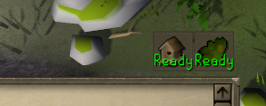

# Time Tracking Reminder

A [RuneLite](https://runelite.net/) plugin which extends the "Time Tracking" plugin to show an infobox when
bird houses or farming patches are ready.

Current supported infoboxes, can be individually enabled and disabled:

- Bird Houses
- Herb Patches
- Tree Patches
- Fruit Tree Patches
- Seaweed Patches
- Bush Patches
- Farming Contract
- Hespori Patch
- Giant compost bin
- Hop Patches
- Al kharid cactus Patch
- Hardwood Patches
- Calquat Patch

## Configuration

This plugin inherits the "Prefer soonest completion" setting of the "Time Tracking" plugin:

- **Checked:** Show an infobox when *any* patches of a specific type are ready
- **Unchecked:** Show an infobox when *all* patches of a specific type are ready
